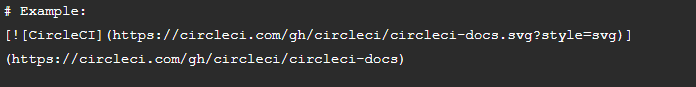
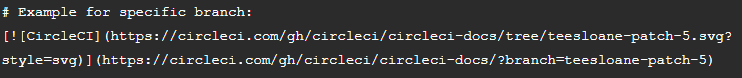
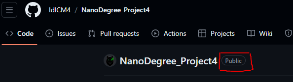
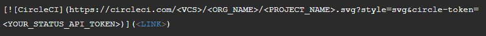
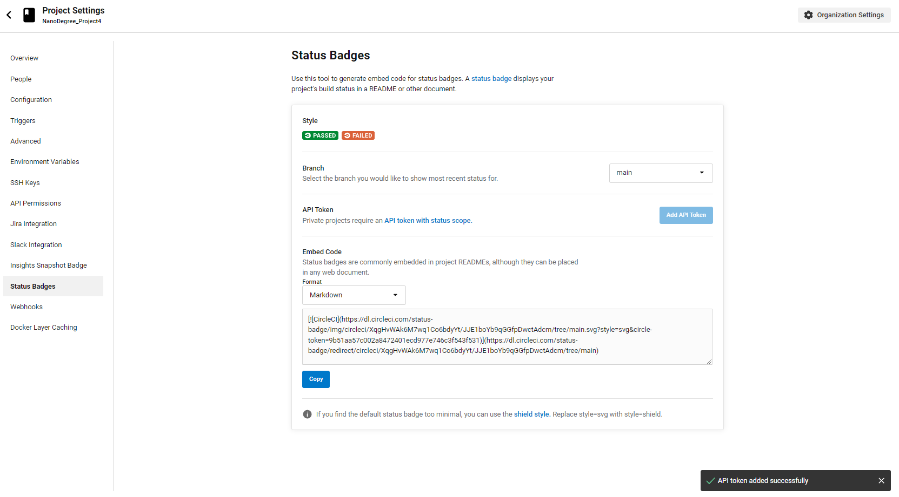
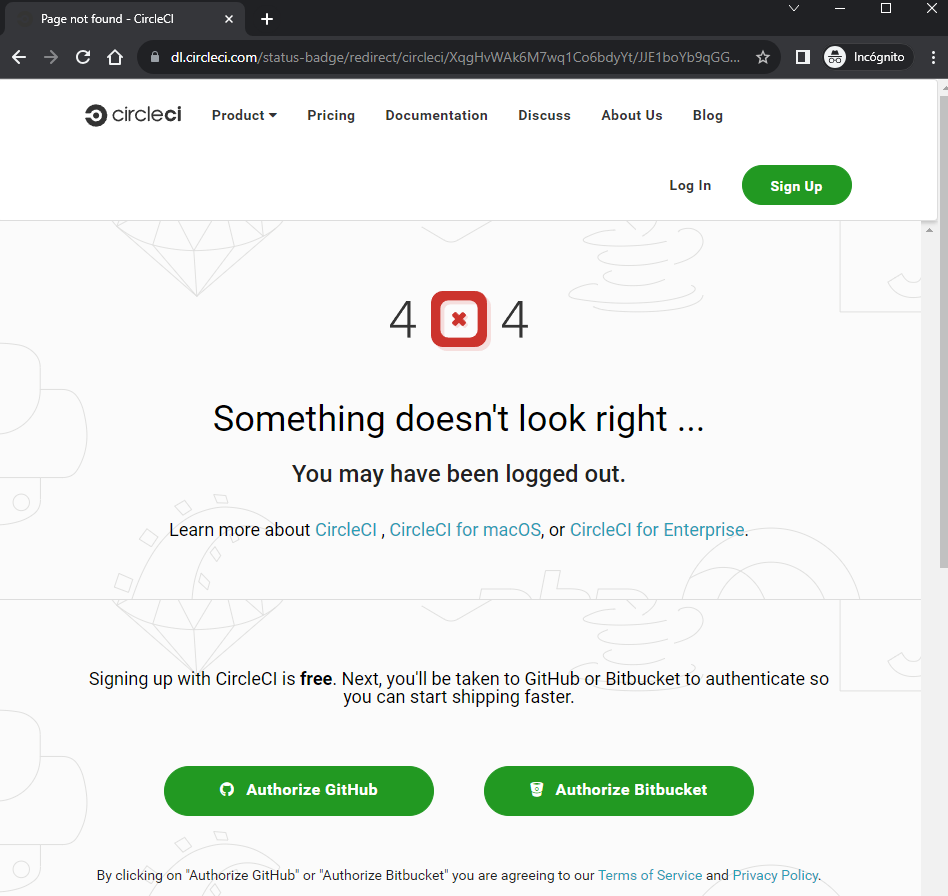
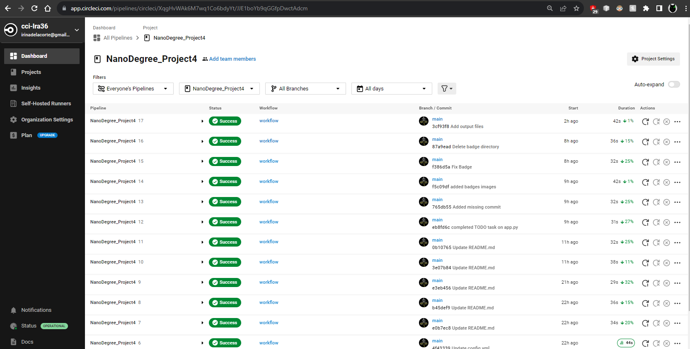

In the task, you are asked to add a status badge on README file to check the status of the project.

This [guide](https://circleci.com/docs/status-badges/) is provided to you, however, after followinf the steps the badge is not working, at least for me.  
There are 3 ways of creating a Badge:  
1. Badbe for the entire project:  

    

    Following this example, my badge would be like this:  

    <pre></pre>
    and this is the result:  
    

    As you can see, it doesn't work.

2. Badge for specific branch:

    

      Following this example, my badge would be like this:  

      <pre></pre>
      and this is the result:  
      

      As you can see, it doesn't show the "passed" badget and the url doesn't work either.

3. Badge for private repositories:  
    This shouldn't be the case, as my gitHub repo is public as you can see on the next image, but let me try as well.  
    

    

      Following this example, my badge would be like this:  

      <pre></pre>  
      and this is the result:  
      

      Doesn't work either.

4. There is another way to generate and include a badge. You have to go to the project -> click on "Project settings" and on the left menu go to Status Bades.

    

    By clicking on "Add API Token" you generate a token and automatically the Markdown is shown to you. This is the code generated:

    <pre></pre> 

    And this is the result:

    

    As you can see, now the badge displays properly but the link shows a page not found:
    

This is my proyect page on CircleCI where you can see the passed builds, the name of the project, the branch, my organization, etc.   
 

I don't know why the links are not working, even the ones that's generating circleCi itself (option 4). Please, if you have any idea of what the problem is or what am I doing wrong let me know.

Kind regards.
